# 📚 DIM-0 – Semantic Academic Wiki Generator

DIM-0 is a modular system that transforms unstructured academic materials (PDFs, slides, notes) into a **linked, non-linear wiki** with semantic search, topic clustering, and interactive graph exploration.

---

## 🚀 Vision

Inspired by the idea of starting at the "zeroth dimension" and expanding knowledge in multiple dimensions, DIM-0 aims to:
- Extract **glossary terms** and definitions from academic documents
- Organize them into **course-based topics**
- Interlink related concepts via **semantic similarity**
- Visualize the wiki as an **interactive knowledge graph**
- Support **students and instructors** with a dynamic, evolving knowledge base

---

## 🧠 Core Features (Planned)

1. **Glossary Extraction** – Identify and store key terms from documents *(LangChain, spaCy, LLMs)*
2. **Topic Grouping** – Cluster related glossary terms into sections *(embeddings, syllabus anchors)*
3. **Internal Linking** – Auto-generate “See also” connections *(FAISS/Chroma)*
4. **Graph Visualization** – Explore concepts in a connected, interactive view *(NetworkX, Cytoscape.js)*
5. **External Enrichment** – Pull related summaries and references *(Wikipedia API)*
6. **Course UI** – Browse, search, and interact with the wiki *(Streamlit/React)*

---

## 🏗️ Planned Architecture

```mermaid
flowchart TD
    A[📄 Raw Academic Docs] --> B["🧠 Glossary Extractor"]
    B --> C["🗃️ Glossary DB (SQLite/CSV)"]
    C --> D1["📂 Topic Clusterer"]
    C --> D2["🔗 Linking Engine (Vector DB)"]
    D1 --> E["📝 Wiki Generator (Markdown)"]
    D2 --> E
    E --> F1["🌐 Web UI"]
    E --> F2["📈 Interactive Graph"]
    C --> G["🌍 Wikipedia Integration"]
```

---

## 🛠️ Tech Stack (Planned)
	- Python for backend processing
	- LangChain + LLMs for extraction and generation
	- spaCy / KeyBERT for NLP term extraction
	- FAISS / Chroma for semantic search
	- SQLite for structured storage
	- Markdown for wiki output
	- NetworkX + Cytoscape.js for graph visualization
	- Wikipedia API for enrichment
	- Streamlit / React for UI

---

## 📍 Roadmap
	-	Build glossary extraction pipeline
	-	Save glossary to SQLite/CSV
	-	Add topic clustering and linking
	-	Generate Markdown wiki pages
	-	Implement graph visualization
	-	Add course-based UI
	-	Integrate external enrichment sources
	-	Deploy as a web app
